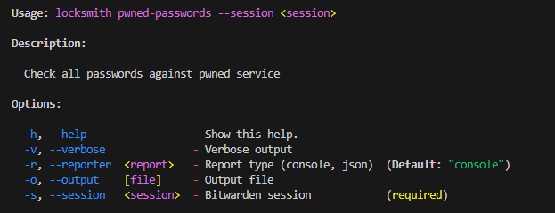
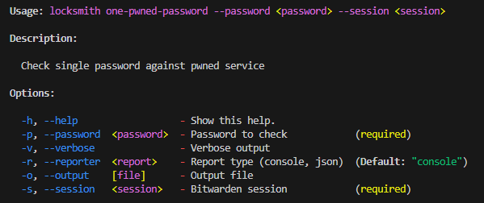
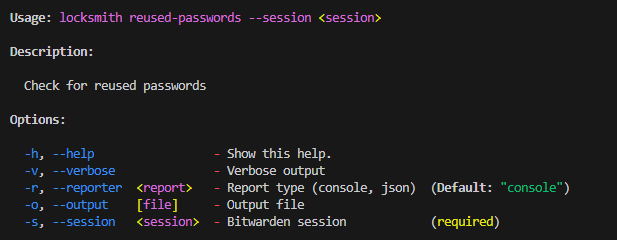
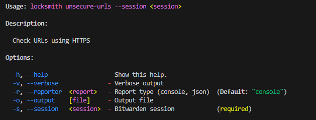

# Locksmith

CLI utility to check Bitwarden credentials for security gaps.

- Check passwords were exposed in data breach using
  [Have I Been Pwned](https://haveibeenpwned.com/) service.
- Report on reused passwords
- Report URLs associated with credentials not using HTTPS

Doesn't store or send credentials anywhere.\
Uses hash snippets to check breaches using k-anonymity model. Read more on Troy
Hunt blog
[here](https://www.troyhunt.com/understanding-have-i-been-pwneds-use-of-sha-1-and-k-anonymity/)

## Dependencies

- [Bitwarden CLI](https://bitwarden.com/help/cli/) (Installed and logged in)
- [Deno Runtime](https://docs.deno.com/runtime/) (Installed)
- [Have I Been Pwned API](https://haveibeenpwned.com/API/v3#PwnedPasswords) (No
  action by user)

## Build & Run

```sh
deno task compile

# Run on windows
.\dist\windows\locksmith.exe --help

# Run on linux
./dist/linux/locksmith --help

# Run on Mac OS (untested)
./dist/macos/locksmith --help
```

## Getting Started with Bitwarden CLI

Locksmith depends on Bitwarden CLI. Install, login and start a session.

1. **Login** Log in with your email:
   ```bash
   bw login <your-email>
   ```

2. **Unlock & Session** Retrieve a session key by unlocking:
   ```bash
   bw unlock
   ```
   Once unlocked, export the session key:
   ```bash
   # linux/maxos
   export BW_SESSION=<your-session-key>
   # windows
   $env:BW_SESSION=<your-session-key>
   ```

## Using Locksmith

Locksmith CLI provides the following commands:

### pwned-passwords



### one-pwned-password



### reused-passwords



## unsecure-urls



## Release

```sh
# match tag to vertion.ts
git tag -a v1.0.0 -m "Release description"
git push origin v1.0.0
```

## Notes

- Lock Bitwarden session when finished:
  ```bash
  bw lock
  ```

## Contributions

Open issues or draft PRs to discuss new features & fixes.

## TODO

Other Password Managers.

- [LastPass CLI](https://github.com/lastpass/lastpass-cli)
